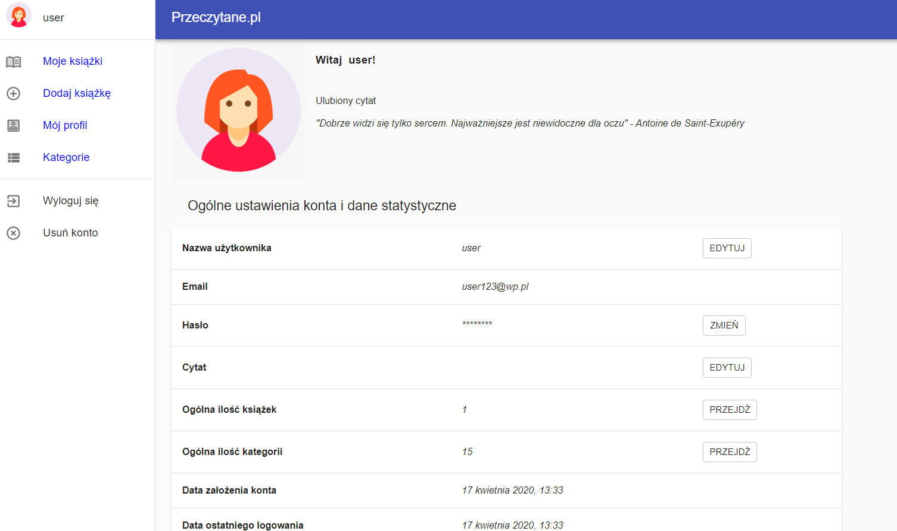

# Przeczytane.pl 

Przeczytane.pl jest to miejsce, gdzie użytkownik może umieszczać informacje o książkach znajdujących się w jego domowej biblioteczce. Ma on możliwość zarządzania nimi, modyfikowania, oceniania i klasyfikowania na podstawie kategorii. Aplikacja charakteryzuje się także intuicyjnym interfejsem ułatwiającym poruszanie się po jej zakładkach.   

## Pierwszy kontakt z aplikacją  
### Interfejs rejestracji
W przypadku pierwszej próby pracy z serwisem użytkownik znaleźć się powinien na ekranie do rejestracji.  

Po wpisaniu danych zastępuje weryfikacja ich poprawności. Sprawdzane jest między          innymi czy wszystkie niezbędne pola zostały uzupełnione oraz przy użyciu wyrażenia regularnego czy email i nazwa użytkownika mają odpowiednią konstrukcję. Istotne jest także określenie czy przypadkiem użytkownik o danym adresie e-mail nie jest już wpisany do bazy danych. Dokonuje się także weryfikacji czy pola hasło i powtórz hasło mają jednakowe wartości. Jeżeli wszystkie dane    zostaną poprawnie uzupełnione zapisywane są w bazie danych i osoba zostaje przekierowana do strony głównej.
### Interfejs logowania 
Strona do logowania daje dostęp do serwisu czytelnikom wcześniej zarejestrowanym. 

Zaimplementowany został mechanizm sprawdzający poprawność podanych danych       oraz wyświetlający odpowiednie ostrzeżenia w przypadku błędów. 

## Moduły po zalogowaniu się w serwisie 
Po zalogowaniu się użytkownik zostaje przeniesiony na ekran główny aplikacji. Przy jego budowie wykorzystano Reactową koncepcję składania strony z reużywalnych komponentów.
### Zakładka Moje książki 
Domyślnie wyświetlana jest zakładka Moje książki. Przedstawia ona listę wszystkich          książek dodanych przez użytkownika wraz z podstawowymi informacjami.Mamy dostęp do takich funkcjonalności jak: usuwanie danej książki, widok szczegółowy, sortowanie ze względu na oceny. 

### Zakładka widoku szczegółowego 
Za pomocą linku zobacz więcej… , który jest umieszczony przy każdej skróconej            reprezentacji książki zarówno na ekranie Moje książki jak przy widoku z podziałem            książek na kategorię, można przejść do ekranu wyświetlającego szczegóły danej lektury.

 
Za pomocą przycisku “Modyfikuj” możliwa jest zmiana danych natomiast symbol śmietniczka wywołuje funkcję odpowiedzialną za  ich usunięcie. Zarówno przy wyświetlaniu, modyfikacji jak i usuwaniu danych   wywoływane są odpowiednie procedury dokonujące zmian w bazie danych. 

### Zakładka Dodaj książkę 
Każdy czytelnik ma możliwość dodawania nowych lektur do swojej biblioteczki. W tym celu należy przejść do strony “Dodaj książkę” na której znajduję się formularz. Poprawność formularza jest nie tylko sprawdzana pod względem występowania    danych obowiązkowych ale także badana jest struktura informacji wpisywanych w pola np. w celu sprawdzenia czy podana liczba w polu Numer (ISBN/ISSN) stanowi ciąg 8, 10 lub 13 cyfr  stosuje się odpowiednio napisane wyrażenie regularne.

 

W przypadku pojawienia się nieprawidłowości system wyświetla odpowiednie komunikaty i nie następuje przesłanie danych do bazy danych. 
### Zakładka Mój profil  
Z menu głównego, po wciśnięciu przycisku Mój profil, użytkownik zostanie przekierowany do panelu ustawień profilu. Został on podzielony na dwie sekcje. W górnej jego części znajduje się miejsce do załadowania avatara ( w przypadku braku ustawienia tej opcji wyświetlany jest obrazek domyślny), który następnie jest widoczny, po za panelem Mój Profil, także w sekcji menu głównego. Po jego prawej stronie jest komunikat powitalny i ulubiony cytat czytelnika. Drugą sekcję tego      widoku stanowią ogólne ustawienia konta i dane statystyczne. Są one ułożone w tabele wyświetlającą takie informacje jak: nazwa użytkownika, email, hasło, cytat, ogólna ilość książek, ogólna ilość kategorii, data założenia konta czy data ostatniego logowania.

    
Do każdej z tych opcji dopisana jest odpowiednia funkcjonalność umożliwiająca zarządzanie kontem. Dla pół nazwa użytkownika, hasło oraz cytat      naciśnięcie przycisku EDYTUJ lub ZMIEŃ spowoduje pojawienie się okna dialogowego umożliwiającego wpisanie nowych danych. Dane przed zapisaniem do  bazy danych są weryfikowane i zwracana jest w razie potrzeby odpowiedź sygnalizująca błąd. 

<em>Obrazek 1: Przykładowe okno dialogowe wyświetlane przy próbie zmiany hasła </em>  

### Zakładka Kategorie 
Ostatnią omawianą zakładką będą Kategorie zawierającą zestaw domyślnych kategorii takich jak np: ostatnio dodane, ulubione, literatura faktu, fantastyka, horror,literatura młodzieżowa i wiele innych. W przypadku próby wyświetlenia lektur z   kategorii ostatnio dodane pokażą się takie, które zostały dodane nie później niż w ciągu jednego miesiąca. Kategoria ulubione agreguje te lektury, których ocena w rankingu jest równa bądź większa niż 4.

 

 
